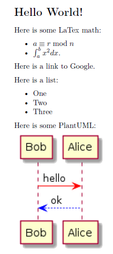

# pandoc-markdown-toolchain

A ready-to-run Docker environment that provides a collection of tools and other goodies for those who like to write in markdown and use pandoc to convert to other formats.

**Warning: This is still under early development. Many things are still in flux.**

## Features

* kindlegen [link](https://wiki.mobileread.com/wiki/KindleGen)
* pandoc [link](https://pandoc.org/)
  * latex / texlive
  * pandoc-citeproc
  * pandoc-crossref
* pandoc-imagine [link](https://github.com/hertogp/imagine)
  * blockdiag
  * ditaa
  * figlet
  * graphviz
  * mscgen
  * nwdiag
  * plantuml
  * seqdiag
  * shbang
* pandoc-run-filter [link](https://github.com/johnlwhiteman/pandoc-run-filter)
  * matplotlib
  * matplotlib-venn
  * numpy
  * pillow
  * pygal

## Prerequisites

You should be able to run this on any major operating system, including, Windows, Linux and macOS, but you'll need to install these programs first:

* Git (so you can clone the project) [[link](https://git-scm.com/downloads)]
* Docker: [[link](https://docs.docker.com/get-docker/)]
* Docker Compose: [[link](https://docs.docker.com/compose/install/)]
* Python >= v3.8 [[link](https://www.python.org/downloads/)]
* Optional: Visual Studio Code on host system [[link](https://code.visualstudio.com/download)]

Note: *~1.56GB disk space is required (yes quite big, but so are your dreams)*

## Install

Open a terminal, clone and install on your device.

```bash
$ https://github.com/johnlwhiteman/markdown-pandoc-toolchain.git
$ cd ./markdown-pandoc-toolchain

# Linux
$ ./bin/go

# Windows
$ .\bin\go.cmd

# Note: This may take a while ... go learn a new language or something.
```

If everything went right, you are now inside the Docker container

## Exit Container

```bash
$ exit
```

## Enter Container

```bash
# Linux
$ ./bin/enter

# Windows
$ .\bin\enter.cmd
```

## Getting Started

Pandoc and all of its tools run inside the container you just created. You need to be inside the container to run them (see *enter/enter.cmd* commands above).

A special folder in this project called *workspace* is shared inside and outside of the container. Under this folder is where you are going to create your markdown. You can create markdown documents inside the container using a tool like *vim*, but we recommend that you use your favorite editor outside of the container instead.

Let's begin with a simple example

### Hello World Example

The following instructions assume your docker container is running that execution is under this project's directory.

* Create a new directory under the *workspace* directory called *myproject*
* Open your favorite editor
* Create a new document called *./workspace/myproject/hello.md*
* Cut-and-paste the following sections into your new markdown document:

```
# Hello World!

Here is some LaText math: $\int_{a}^{b} x^2 dx$.

Here is a link to [Google](https://google.com).

Here is a list:

* One
* Two
* Three
```
``````

Here is some PlantUML:

```plantuml
@startuml
    Bob -[#red]> Alice : hello
    Alice -[#0000FF]->Bob : ok
@enduml
```
``````

* Open a new console / terminal
* Enter the docker container

```bash
# Linux
$ ./bin/enter

# Windows
$ .\bin\enter.cmd
```

* Go to your *myproject* directory

```bash
$ ls
$ cd ./myproject
```

* Run the following *pandoc* command

```bash
$ pandoc -s --filter pandoc-imagine -i hello.md -o hello.pdf
```

If everything goes right, a new *hello.pdf* file is created next to *hello.md*. You can see it both inside and outside of the container. The *hello.pdf* should look something like this:



Of course, pandoc is capable of much more.

## Other Commands

### Build Image
```bash
# Linux
$ ./bin/build

# Windows
$ .\bin\build.cmd
```

### Run Container
```bash
# Linux
$ ./bin/run

# Windows
$ .\bin\run.cmd
```

### Enter Interactive Shell Mode
```bash
# Linux
$ ./bin/enter

# Windows
$ .\bin\enter.cmd
```

### Stop Container
```bash
# Linux
$ ./bin/stop

# Windows
$ .\bin\stop.cmd
```

### Start Container
```bash
# Linux
$ ./bin/start

# Windows
$ .\bin\start.cmd
```

### Show Statues
```bash
# Linux
$ ./bin/show

# Windows
$ .\bin\show.cmd
```

## Test

```bash
# Linux
$ ./bin/test

# Windows
$ .\bin\test.cmd

# All tests should pass
```

### Remove All
```bash
# Linux
$ ./bin/clean

# Windows
$ .\bin\clean.cmd

# Note: All content under ./projects is preserved
```

## Troubleshooting

Make sure docker is running before running any of the commands above


